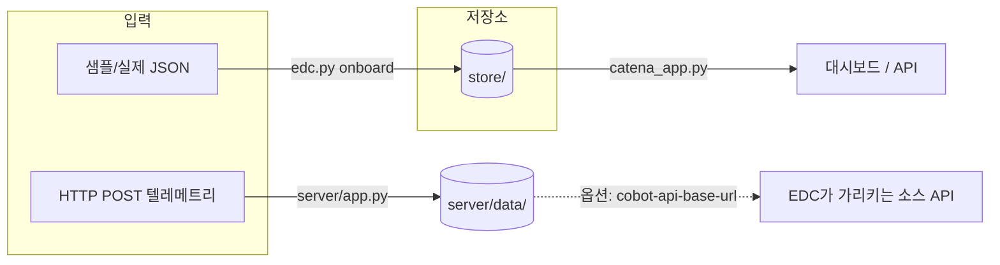
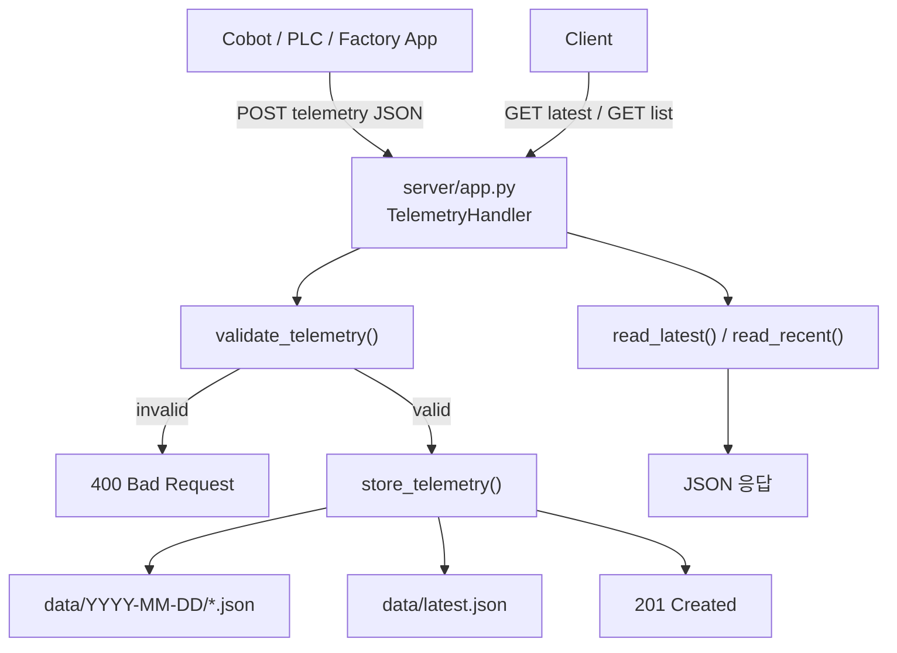
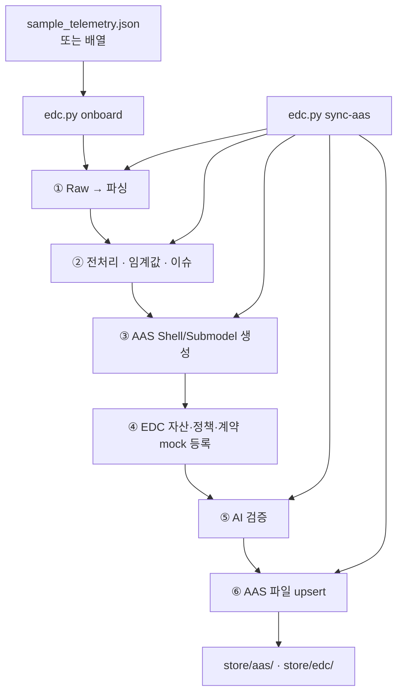
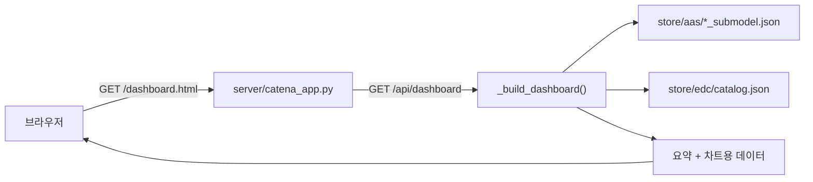

# Catena-X SW 구현 예

[대시보드](http://127.0.0.1:8765/dashboard.html)

## Catena-X 정의

**Catena-X**는 자동차 등 산업 **데이터를 안전하게 연결·공유**하기 위한 **유럽 주도 데이터 스페이스** 생태계입니다. 
| 용어 | 한 줄 설명 |
|------|--------|
| **EDC (Eclipse Dataspace Components)** | “누가 어떤 데이터에 **어떤 조건으로 접근**할 수 있는지”를 **계약·정책**으로 관리하는 쪽 |
| **AAS (Asset Administration Shell)** | 설비·로봇 같은 자산을 **디지털 트윈 JSON**으로 표현하는 **표준화된 모델** |

이 코드파일은 **로컬 JSON만으로** 위의 개념을 *적용 해 보는 구현 단계**입니다.

---

## 프로젝트 개요

공장·앱이 보내는 **협동로봇 텔레메트리(JSON)** 를 받아서:

1. 규칙으로 **전처리·품질 플래그**를 붙이고  
2. **AAS Shell / Submodel** 파일로 바꿔 저장하고  
3. **EDC 자산·정책·카탈로그(mock)** 를 로컬에 쌓은 뒤  
4. **웹 대시보드**로 플릿 상태를 볼 수 있게 합니다.

**AI(Ollama)** 는 **선택 사항**이며, 판단을 바꾸지 않고 **참고용 설명**만 붙입니다.

---

## 폴더 구조

```
catena-x/
├── apps/catenax/
│   ├── edc.py                 # CLI: onboard, sync-aas, list, export-catalog
│   ├── aas_mapper.py          # 전처리 + AAS 매핑
│   ├── models.py              # Raw / Normalized 데이터 타입
│   ├── ai_helpers.py          # Ollama 호출
│   └── sample_telemetry.json  # 샘플 입력 (단일 객체 또는 로봇 배열)
├── server/
│   ├── app.py                 # 텔레메트리 HTTP 수신 → 디스크 저장
│   └── catena_app.py          # 대시보드 + /api/dashboard (store 읽기)
├── dashboard.html             # UI (catena_app.py가 서빙)
└── store/                     # 생성됨, git 제외 — mock 결과 전부 여기
    ├── aas/                   # Shell / Submodel JSON
    └── edc/                   # 자산, 정책, 카탈로그 등
```

---

## 전체 흐름 (한눈에)



- **대시보드**는 `sample_telemetry.json`을 직접 읽지 않습니다. **`edc.py onboard`로 만든 `store/aas/`** 를 읽습니다.  
- **실시간 수집**은 `server/app.py`가 담당하고, **의미·카탈로그·AAS 반영**은 `edc.py`가 담당합니다.

---

## ① 실시간 텔레메트리 수집 (선택)

공장/PLC/앱이 REST로 넣을 때의 경로입니다.



| 구분 | 입력 | 출력 |
|------|------|------|
| `server/app.py` | `POST /api/v1/cobot/telemetry` 본문(JSON) | 날짜별 파일 + `latest.json`, HTTP 상태 |
| 같은 서버 | `GET …/latest`, `GET …?limit=N` | 저장된 JSON |

기본 데이터 디렉터리: **`server/data/`** (환경 변수로 변경 가능).

---

## ② 온보딩 파이프라인 (중요**)

파일에서 읽거나, 나중에 HttpData 자산이 가리킬 **같은 형태의 JSON**으로 **AAS + mock EDC**를 채웁니다.



| 단계 | 입력 | 출력(요지) |
|------|------|------------|
| ① | JSON 한 건 | `RawTelemetry` |
| ② | Raw | 정규화 + `quality_flag`, 이슈 목록 |
| ③ | Normalized | 메모리 상 Shell / Submodel |
| ④ | Normalized + BPN 등 | `store/edc/` 에 자산·정책·카탈로그 |
| ⑤ | Normalized | Ollama 요약(실패해도 파이프라인은 성공) |
| ⑥ | Shell / Submodel | `store/aas/*_shell.json`, `*_submodel.json` |

**`sync-aas`**: ④를 건너뛰고 **AAS만** 갱신할 때 사용 (주기적 업데이트용).

---

## ③ 대시보드



| 구분 | 입력 | 출력 |
|------|------|------|
| `catena_app.py` | `CATENAX_STORE_DIR` 아래 mock 파일 | HTML, `/api/dashboard`, `/api/robots/...` |

---

## AI 활용:

| 항목 | 내용 |
|------|------|
| **위치** | `edc.py` 파이프라인 **5단계**, `ai_helpers.py` |
| **켜는 법** | `onboard` / `sync-aas` 에 **`--use-ai`** (Ollama가 떠 있어야 함) |
| **역할** | 전처리된 텔레메트리를 **자연어로 이상 징후 참고**. **등록·저장 결정은 항상 규칙 기반** |
| **꺼져 있을 때** | 그냥 건너뜀. 전체 동작에는 문제 없음 |
| **환경 변수** | `OLLAMA_BASE_URL`, `OLLAMA_MODEL`, `OLLAMA_TIMEOUT` 등 |

---

## 최종 산출물 

| 산출물 | 설명 |
|--------|------|
| `store/aas/*_shell.json` | 로봇(자산) 단위 Shell |
| `store/aas/*_submodel.json` | 텔레메트리·품질·키네마틱 등 **대시보드가 읽는 본체** |
| `store/edc/` | mock 자산 ID, 정책, **카탈로그**(대시보드 테이블) |
| `server/data/` | **`app.py`로 POST한 경우만** — 일별 JSON, `latest.json` |

---

## JSON 수정 후 (0416 대시보드 기준)

1. `apps/catenax/sample_telemetry.json` 편집·저장 (단일 로봇 객체 또는 **로봇 배열**).  
2. **같은** `CATENAX_STORE_DIR`로 다시 온보딩:

```bash
cd catena-x
export CATENAX_STORE_DIR="$PWD/store"
python3 apps/catenax/edc.py onboard \
  --telemetry-json apps/catenax/sample_telemetry.json \
  --provider-bpn BPNL000000000001 \
  --all-records
```

3. 대시보드 **새로고침** (`catena_app.py` 실행 중이어야 함).

플릿만 보려면 기본이 첫 레코드만이므로 **`--all-records` 필수**.

---

## 빠른 실행 예시

**Mock 온보딩 + 대시보드**

```bash
cd catena-x
export CATENAX_STORE_DIR="$PWD/store"
mkdir -p store

python3 apps/catenax/edc.py onboard \
  --telemetry-json apps/catenax/sample_telemetry.json \
  --provider-bpn BPNL000000000001 \
  --all-records

python3 server/catena_app.py --port 8765
# 브라우저: http://127.0.0.1:8765/dashboard.html
```

**텔레메트리 수집 서버(별 포트)** — 실제 POST 테스트용:

```bash
python3 server/app.py --host 0.0.0.0 --port 8080
```

온보딩 시 HttpData가 이 API를 가리키게 하려면 `edc.py onboard`에  
`--cobot-api-base-url http://127.0.0.1:8080` 를 추가합니다.

---

## CLI 요약

| 명령 | 설명 |
|------|------|
| `onboard --telemetry-json … --provider-bpn …` | 전체 파이프라인 (①~⑥) |
| `onboard … --all-records` | JSON이 **배열**일 때 **모든 로봇** 처리 (기본은 **첫 레코드만**) |
| `sync-aas --telemetry-json …` | **AAS만** 갱신 (EDC 재등록 없음) |
| `list` | 등록된 mock 자산·AAS 요약 |
| `export-catalog` | 로컬 카탈로그 JSON 덤프 |

---

## 자주 사용하는 환경 변수

| 변수 | 역할 |
|------|------|
| `CATENAX_STORE_DIR` | mock 루트 (`store/`). **대시보드와 onboard가 반드시 같아야 함** |
| `CATENAX_EDC_MANAGEMENT_URL` | 설정 시 **실제** EDC Management API (미설정이면 로컬 mock) |
| `CATENAX_AAS_BASE_URL` | 설정 시 **실제** AAS 서버 (미설정이면 로컬 파일) |

---

## 참고

- [Eclipse Dataspace Components (EDC)](https://eclipse-edc.github.io/) — Tractus-X 등에서 사용  
- [AAS / IDTA 협동로봇 서브모델 개념 ](https://github.com/jeonghoonkang/BerePi/tree/master/apps/catenax)
- Cursor AI for code generation/ Chat GPT for telemetry generation
