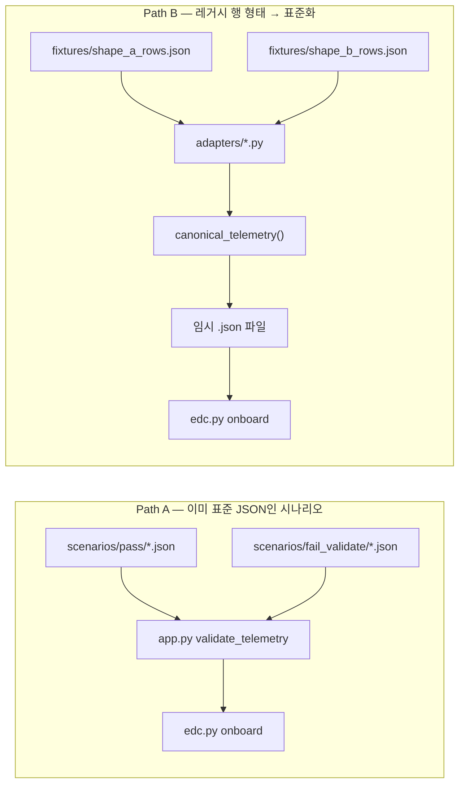
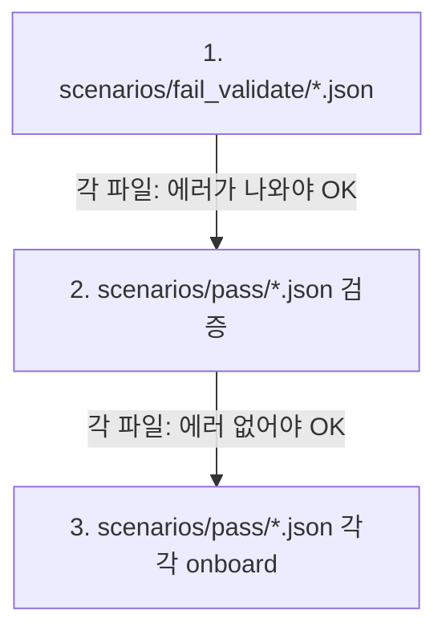
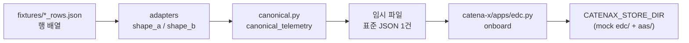

# data-space-verify

`catena-x` **소스는 건드리지 않고**, 텔레메트리가 들어왔을 때 **검증·온보딩(패키징) 파이프라인이 깨지지 않는지** 스모크 테스트하는 보조 폴더입니다.  
서버를 띄우거나 원격 Postgres에 붙을 필요는 없습니다. `../catena-x` 의 `server/app.py`(검증)와 `apps/edc.py onboard`(mock EDC·AAS 쓰기)만 **import / subprocess** 로 호출합니다.

---

## Overview

두 갈래가 있습니다. **둘 다 끝에서 같은 `edc.py onboard` 한 건**을 밟습니다. 입력만 다릅니다.




| Path  | 대표 스크립트                       | 입력                                 | 하는 일                            |
| ----- | ----------------------------- | ---------------------------------- | ------------------------------- |
| **A** | `scripts/verify_matrix.py`    | 이미 **표준 스키마**인 JSON 파일들            | 통과/실패 케이스별로 검증 규칙 확인 + (옵션) 온보딩 |
| **B** | `scripts/run_package_flow.py` | DB에서 꺼낸 것처럼 **컬럼명이 다른** 행 배열(JSON) | 어댑터로 표준 dict로 만든 뒤, 행마다 온보딩     |


---

## 전제 조건


| 항목      | 설명                                                                             |
| ------- | ------------------------------------------------------------------------------ |
| 디렉터리 위치 | 이 폴더와 **형제**로 `catena-x` 가 있어야 합니다. 기본 경로: `eunbi/catena-x` (= `../catena-x`). |
| Python  | 3.x. **SQLite는 쓰지 않습니다.** 행 데이터는 `fixtures/*_rows.json` 만 읽습니다.                |
| 의존성     | `catena-x` 쪽에서 `apps/edc.py` 를 실행하는 데 필요한 패키지가 설치되어 있어야 합니다.                   |


---

## 폴더 설명:

```
data-space-verify/
  scenarios/
    pass/              # 검증 통과 + onboard 대상(표준 JSON)
    fail_validate/     # 검증에서 막혀야 하는 나쁜 JSON
  fixtures/
    shape_a_rows.json  # 형태 A: 레거시 컬럼명(예: robot_name, cycle_ms …)
    shape_b_rows.json  # 형태 B: 다른 이름(예: device_id, cycle_time_ms …)
  adapters/
    shape_a.py, shape_b.py   # 행 dict → canonical_telemetry
  canonical.py         # 표준 텔레메트리 dict 한 건 생성 (app.py 규칙에 맞춤)
  scripts/
    verify_matrix.py   # 갈래 A
    run_package_flow.py # 갈래 B
```

---

## Path A — `verify_matrix.py` (시나리오 매트릭스)

**목적:** “우리가 기대하는 표준 JSON”이 **검증을 통과하는지**, 깨진 JSON은 **거절되는지**, 통과한 것은 `**edc.py onboard` 가 0으로 끝나는지**를 한 번에 확인합니다.

### 실행 순서 (스크립트가 실제로 도는 순서)




1. **fail_validate** — `validate_telemetry` 가 **에러를 돌려줘야** 성공(의도적 실패 케이스).
2. **pass 검증만** — 같은 함수로 **에러가 없어야** 성공.
3. **pass onboard** — 각 파일마다 **새 임시 `CATENAX_STORE_DIR`** 를 잡고 `edc.py onboard --telemetry-json …` 실행. exit code 0 이어야 성공.

### 명령어

```bash
cd data-space-verify
python3 scripts/verify_matrix.py
# Ollama 없이 빠르게:
python3 scripts/verify_matrix.py --no-ai
```


| 옵션                   | 설명                                           |
| -------------------- | -------------------------------------------- |
| `--catena-root PATH` | `catena-x` 루트. 기본: `../catena-x`             |
| `--skip-onboard`     | 3단계(onboard) 생략. 검증만 돌릴 때                    |
| `--no-ai`            | onboard 시 `edc.py` 에 `--no-ai` 전달(Ollama 생략) |
| `--provider-bpn`     | onboard에 넘기는 BPN. 기본 `BPNL000000000001`      |


마지막에 `요약: OK=… NG=…` 가 나옵니다. `NG` 가 0이면 전부 통과입니다.

---

## Path B — `run_package_flow.py` (여러 “DB 행” 형태 → 표준 JSON → onboard)

**목적:** 현장마다 다른 **테이블/컬럼 이름**을 가진 데이터를, 같은 **표준 텔레메트리 JSON**으로 바꾼 뒤 **온보딩이 되는지** 보여 주는 로컬 PoC입니다.  
여기서는 DB 대신 **JSON 배열**에 행을 넣어 두었습니다. 키 이름만 “SQL에서 `SELECT` 한 한 줄”과 같다고 보면 됩니다.

### 데이터 흐름




- **shape_a_legacy** — `shape_a_rows.json` 의 레거시 필드명을 읽어 `canonical_telemetry(...)` 로 맵핑.
- **shape_b_line** — `shape_b_rows.json` 의 다른 필드명을 읽어 같은 함수로 맵핑.
- 각 **행마다** 임시 JSON을 쓰고 `onboard` 를 한 번씩 호출합니다. 한 실행에서 쓰는 `CATENAX_STORE_DIR` 는 **하나의 임시 폴더**로 고정되어, 여러 번 onboard 하면서 store가 쌓입니다.
- 끝에 **EDC 쪽 JSON 파일들의 항목 수·AAS json 개수** 같은 요약이 한 번 출력됩니다.

### 명령어

```bash
cd data-space-verify
python3 scripts/run_package_flow.py --no-ai
```


| 옵션                   | 설명                    |
| -------------------- | --------------------- |
| `--catena-root PATH` | 기본 `../catena-x`      |
| `--no-ai`            | onboard 시 `--no-ai`   |
| `--provider-bpn`     | 기본 `BPNL000000000001` |


---

## 무엇을 하지 않나 (범위)

- HTTP로 Catena 서버에 쏘거나, 원격 Postgres에 **접속해 검증하는 단계는 없습니다.**
- `catena-x` 안의 비즈니스 로직을 바꾸지 않습니다. 이 폴더는 **검증·온보딩이 회귀 없이 도는지** 보는 용도입니다.

---

## 자주 쓰는 조합


| 상황              | 명령                                                |
| --------------- | ------------------------------------------------- |
| CI / 빠른 회귀      | `python3 scripts/verify_matrix.py --no-ai`        |
| 검증 규칙만          | `python3 scripts/verify_matrix.py --skip-onboard` |
| 레거시 행 → 패키지 스모크 | `python3 scripts/run_package_flow.py --no-ai`     |


---

## 다음에 확장하기 좋은 것

- `scenarios/` 를 산업·고객별로 나누기 (`automotive/`, `battery/` 등).
- 갈래 B에 **세 번째 컬럼 세트**를 추가하려면 `fixtures/` + `adapters/` + `adapters/__init__.py` 의 `ADAPTERS` 목록만 늘리면 됩니다.

