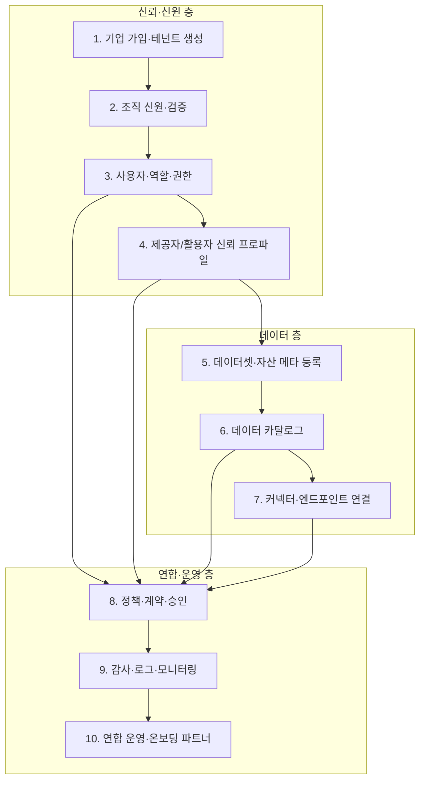

# KMX 기업 참여 플랫폼 — 설계 초안

[http://127.0.0.1:8090/app/index.html](http://127.0.0.1:8090/app/index.html) 

## 1. 요약

국내 제조사가 **Catena-X·한국형 KMX**에 **제공자**로 참여할 때, **가입 → 신원·권한 → 데이터·카탈로그·커넥터 → 정책·감사**가 **한 플랫폼 안에서 같은 Tenant·같은 로그로** 이어지게 하는 상위 허브(설계·구현 방향)

Expected 산출물:
**SQL(스키마)** + **API 코드** + **(선택) 얇은 웹 UI** + **API 설명서**(어떤 URL에 뭘내면 뭐가 오는지; 보통 `openapi.yaml` 형식). 범위 줄이면 DB+API만으로도 데모 가능.

---

## 2. Role


| 역할                   | 설명                                              |
| -------------------- | ----------------------------------------------- |
| **기업 (Tenant)**      | KMX에 “조직”으로 등록되는 법인/사업장 단위.                     |
| **기업 내 사용자**         | 실제로 버튼 누르는 사람 (관리자, 데이터 오너, 보안 담당 등).           |
| **데이터 제공자**          | 자사 데이터셋·커넥터를 등록·노출하는 주체 (한 기업 안의 여러 부서 가능).     |
| **데이터 활용자**          | 카탈로그에서 찾아 계약/승인 후 가져다 쓰는 주체 (같은 플랫폼 또는 연합 파트너). |
| **플랫폼 운영자 (KMX 허브)** | 가입 승인, 정책 템플릿, 연합 규칙, 분쟁·감사 대응.                 |


*제공자와 활용자는 “기업”의 하위 역할이며, 한 기업이 둘 다 될 수 있습니다.*


| 항목        | 내용                                                                                            |
| --------- | --------------------------------------------------------------------------------------------- |
| 허브        | **협회 + 민간** 등 **이해관계자 다중** (승인·정책·감사 역할 분리 전제)                                                |
| 첫 고객      | **데이터 제공자 위주** (등록·노출·연결 플로우 우선)                                                              |
| 법적 메타     | **베이직만** (예: 개인정보 여부, 근거 유형 한 칸, 한 줄 메모). 긴 법무 폼·증빙은 후속                                       |
| BPN / DSP | **BPN** = 조직 ID → Tenant 활성화 시점에 **필드 두고 발급·기입**. **DSP** = 실제 교환·계약 → **데이터셋 승인·게시 이후**에 묶어서 |


---

## 3. 구조

(**시간 순서** X 관계성 ㅇ: 위가 아래를 “허용)




**“단일 플랫폼”의 최소 의미:**  
같은 **Tenant ID**, 같은 **로그인·권한**, 같은 **감사 ID**로 1→10까지 추적 가능해야 합니다.

---

## 4. 단계별 구체화

### 4.1 기업 가입 (표준 절차 초안)


| 단계  | 사용자가 하는 일          | 플랫폼이 하는 일                            | 산출물                                    |
| --- | ------------------ | ------------------------------------ | -------------------------------------- |
| G-1 | 가입 의사·담당자 이메일 제출   | 중복·도메인 화이트리스트(선택) 검사                 | `registration_request`                 |
| G-2 | 사업자등록번호·법인명 등 제출   | (MVP) 수동 검증 큐 또는 (후속) 공공/제3자 KYC API | `tenant` 초안, 상태 `pending`              |
| G-3 | 운영자 승인 또는 자동 규칙 통과 | Tenant 활성화, 기본 “참여 약관” 동의 기록         | `tenant` = `active`, `agreement_audit` |
| G-4 | 첫 관리자 계정 생성        | 최초 사용자에게 `org_admin` 부여              | `user` + `membership`                  |


**Catena-X와의 말 맞추기:** 나중에 **BPN(Business Partner Number)** 같은 글로벌 식별자를 Tenant에 매핑하는 필드를 비워 두면, 지금 설계가 깨지지 않습니다.

---

### 4.2 신원 인증·권한 (기업 단위)


| 구분      | MVP에서 현실적인 선택                                               | 나중에 강화                 |
| ------- | ----------------------------------------------------------- | ---------------------- |
| 사용자 로그인 | **OIDC** (Keycloak 등) + 이메일 도메인 = 테넌트 힌트                    | 하드웨어 토큰, 사내망 SSO       |
| 조직 신원   | 사업자번호 + 법인명 + **운영자 승인** 또는 서류 업로드                          | 전자증명·DID/VC, 마이데이터 연계  |
| 권한      | **RBAC** (역할: org_admin, data_steward, security_auditor, …) | 속성 기반 ABAC, 데이터셋 단위 위임 |


**권한이 꼭 필요한 이유:** 카탈로그 공개 범위, 커넥터 시크릿, 계약 서명 주체를 **사람 단위**로 나누지 않으면 운영이 불가능합니다.

---

### 4.3 데이터 등록 → 카탈로그 → 커넥터


| 단계  | 내용                                                                                       | 다른 단계와의 연결                              |
| --- | ---------------------------------------------------------------------------------------- | --------------------------------------- |
| D-1 | **데이터셋(자산) 메타**: 제목, 설명, 도메인(예: 품질·설비), 민감도 등급, 법적 근거                                    | Tenant·신뢰등급 태그와 연결                      |
| D-2 | **기술 메타**: 스키마 힌트, 갱신 주기, 샘플 (가짜 데이터)                                                    | 검증 파이프라인 입력                             |
| D-3 | **카탈로그 등록**: 검색·필터용 태그, 공개 범위(내부 연합 / 특정 파트너 / …)                                        | 정책(POL)과 동기화                            |
| D-4 | **커넥터**: 실제 소스(DB, OPC, 파일)는 기업망 안에 두고, **플랫폼이 아는 것은 “연결 프로필”** (엔드포인트 유형, 인증 방식, 허용 IP) | 시크릿은 Vault류, 감사 로그에 “누가 어떤 프로필을 만들었는지”만 |


**중요한 원칙:** “데이터가 플랫폼 디스크에 복사된다”가 아니라, **메타·정책·접근 경로**가 플랫폼에 있고 **원본은 기업 측**에 남는 그림이 Catena-X·EDC 정신과 맞습니다.

---

### 4.4 보안·신뢰·연합 운영 (통합 구현 관점)


| 기능 묶음       | 무엇을 구현하면 “통합”이라 말할 수 있나                                                           |
| ----------- | --------------------------------------------------------------------------------- |
| **신뢰 프로파일** | Tenant마다 “검증 수준”(예: 사업자만 확인 / 현장실사 / 제3자 인증)과 만료일. 카탈로그에 배지로 노출.                  |
| **정책·계약**   | 데이터셋별 “누가 읽을 수 있는지”를 **정책 템플릿**으로 만들고, 활용자 요청 시 **승인 워크플로** (제공자 측 data_steward). |
| **연합 운영**   | 파트너 기업 초대, 연합 단위 카탈로그 뷰, 분쟁 시 감사 로그 조회 권한 (운영자).                                  |


---

## 5. 구현 모델

검토용으로 **서비스 경계**만 제안합니다. 처음엔 **모노리포 + 모듈**로 시작해도 됩니다.


| 모듈 (논리 이름)            | 책임                | 대표 엔티티/API 스케치                                         |
| --------------------- | ----------------- | ------------------------------------------------------ |
| `tenant-registry`     | 가입, Tenant, 약관 동의 | `POST /tenants`, `GET /tenants/{id}`                   |
| `identity-iam`        | 사용자, 로그인, 역할      | `POST /users/invite`, `PUT /memberships`               |
| `org-trust`           | 조직 신원 검증 상태       | `POST /tenants/{id}/verification`, 상태 머신               |
| `asset-catalog`       | 데이터셋 메타, 검색       | `POST /datasets`, `GET /catalog/search`                |
| `connector-fabric`    | 연결 프로필, 헬스체크      | `POST /connections`, `GET /connections/{id}/status`    |
| `policy-contracts`    | 접근 정책, 승인, 계약 이벤트 | `POST /policies`, `POST /access-requests`              |
| `audit-observability` | 모든 모듈이 쓰는 감사 스트림  | `audit_events(tenant_id, actor, action, resource_ref)` |


**한 요청이 여러 모듈을 타는 예:**  
“활용자가 접근 요청” → `policy-contracts`가 요청 생성 → `asset-catalog`로 자산 존재 확인 → `org-trust`로 상대 Tenant 신뢰등급 확인 → 승인 시 `connector-fabric`에 통지(실제 연결은 별 프로토콜).

---

## 6. MVP vs 이후


| 구분   | MVP (처음에 진짜로 만들 만한 것)           | 이후                      |
| ---- | ------------------------------- | ----------------------- |
| 가입   | 이메일 + 사업자번호 + 운영자 승인            | 자동 KYC, 파트너 은행 연계       |
| 신원   | RBAC + 감사 로그                    | DID/VC, 국내 신원 인프라 표준 반영 |
| 카탈로그 | 메타만, 검색 단순                      | 스키마 레지스트리, 품질 점수        |
| 커넥터  | “연결 프로필 + 토큰” 수준, 실제 데이터는 샘플/스텁 | EDC/DSP 호환, 실망 연동       |
| 연합   | “초대 링크 + 같은 플랫폼 내 두 Tenant”     | 크로스 허브 페더레이션            |


---

## 7. 지금 Catena-X 작업과 이어 붙이는 말

- 지금 쓰는 `edc.py onboard`·mock store 는 나중에 **“D-3~D-4 이후 자동 등록 스텁”** 정도로 보면 됩니다.
- 이 폴더(`kmx-enterprise-journey`)는 **사람·조직·정책·카탈로그 상위 레이어**를 먼저 고정하는 용도입니다.

---

## 8. 결정 기록 (검토 반영)


| 항목              | 확정                                                                          |
| --------------- | --------------------------------------------------------------------------- |
| **KMX 허브**      | **이해관계자 다중** (협회 + 민간 등). 승인·정책·감사에 **역할이 나뉜 운영**을 전제로 설계합니다.               |
| **첫 고객**        | **제공자 위주**. MVP 화면·API 우선순위는 “우리 데이터를 등록·노출·연결” 쪽을 먼저 깎습니다.                 |
| **법적 근거(메타)**   | **베이직만**. 아래 “8.1” 참고. 고도화는 나중에 필드만 늘리면 됩니다.                                |
| **BPN·DSP 타이밍** | 아래 “8.2” 참고. **한 문장 요약:** BPN은 조직 식별 쪽, DSP는 실제 데이터 교환 쪽이라 **시점이 달라도 됩니다.** |


### 8.1 “법적 근거 필수 필드”가 뭐였냐면

데이터셋 카드에 “이 데이터는 **왜** 올려도 되는지”를 적게 하자는 뜻이었습니다. (개인이 들어있나, 영업비밀인가, 수집·제공 근거가 뭔가.)

**질문이 어려웠던 이유:** 법률적으로 완벽한 체크리스트를 처음부터 넣자는 뜻이 **아니었습니다.**

**MVP에서의 “베이직” 제안 (필수 최소):**


| 필드                       | 예시                                               | 비고                       |
| ------------------------ | ------------------------------------------------ | ------------------------ |
| `legal_basis_type`       | `none` / `consent` / `contract` / `law` 중 하나 고르기 | 나중에 세분화                  |
| `contains_personal_data` | 예 / 아니오                                          | 불명이면 “예”로 가정하는 운영 규칙도 가능 |
| `confidentiality_note`   | 짧은 자유서술 (선택이 아니라 **한 줄만** 필수로 해도 됨)              | “내부 품질 지표, 개인정보 없음” 수준   |


법률 검토용 긴 서식·증빙 파일 업로드·자동 판별은 **고도화 단계**로 미룹니다.

### 8.2 BPN과 DSP를 쉽게 말하면

- **BPN (Business Partner Number):** 데이터스페이스 안에서 **“이 회사는 누구인가”**를 가리키는 **조직 주소 번호**에 가깝습니다. 명함에 회사 이름이 있듯, 시스템이 서로 부를 때 쓰는 **식별자**입니다.
- **DSP (Dataspace Protocol):** **실제로 커넥터끼리** 데이터를 주고받을 때 쓰는 **통신·계약 절차** 쪽 개념입니다. “회사 등록”과는 층이 다릅니다.

그래서 예전 질문은 이렇게 읽으면 됩니다.

- **Tenant 생성 직후 BPN?**  
회사가 플랫폼에 승인되는 순간, 협회/허브가 “글로벌 주소”를 **배정해 줄 수 있다**는 뜻입니다. DB에는 `tenant.bpn` 칸이 생기고, 아직 데이터셋이 없어도 됩니다.
- **데이터셋 승인 후 DSP?**  
“무슨 데이터를 파는지/연결할지”가 정해진 뒤에야 **커넥터·계약 URL·프로토콜 설정**이 의미가 생긴다는 뜻입니다.

**추천 (제공자 위주 MVP와 맞춤):**

1. Tenant가 **활성화될 때** `bpn` 필드를 **비워 두거나, 허브가 발급·기입** (조직 신원과 같은 층).
2. **첫 데이터셋이 “승인·게시”될 때** DSP 관련 설정(엔드포인트, 정책 링크, catena-x 쪽 onboard 트리거 등)을 **묶어서** 진행 (데이터 층).

즉, **둘 중 하나만 고르는 문제가 아니라**, 보통은 **BPN은 앞, DSP 연동 묶음은 데이터 준비된 뒤**가 자연스럽습니다.

---

## 9. 산출물


| 층            | 나오는 것                                                                      | 비유                     |
| ------------ | -------------------------------------------------------------------------- | ---------------------- |
| **데이터 저장**   | **SQL 스키마** (PostgreSQL 등) + 마이그레이션 파일, 또는 SQLite로 프로토타입                   | “명부”가 어떤 칸으로 구성되는지     |
| **서비스**      | **코드** (예: Python/FastAPI, Node 등) + **REST API**                          | 버튼을 눌렀을 때 DB가 어떻게 바뀌는지 |
| **사람이 쓰는 것** | **웹 화면** (관리자·제공자용). MVP는 화면을 최소로 하고 **API + 간단 UI**만 있어도 “동작”은 증명 가능      | 스프레드시트 대신 쓰는 얇은 껍데기    |
| **문서**       | **API 설명서**(요청·응답·URL 목록; 흔히 OpenAPI/`openapi.yaml`로 작성), README, 필요 시 순서도 | 타팀·외주와 맞출 “약속”         |


정리하면, **“그냥 코드만”이 아니라** 보통은 **(1) DB/SQL (2) API 코드 (3) 얇은 화면**이 세트로 나오고, 범위를 줄이면 **(1)+(2)만**으로도 데모는 가능합니다. SQL만 덩그러니 있는 건 아니고, **SQL은 그 코드가 쓰는 저장소**입니다.

---

## 10. MVP API 구현 (여기까지 코딩됨)

### 한 줄로

**FastAPI** 한 덩어리 + **JSON 파일** 하나(`data/hub_state.json`)에 상태를 저장합니다. (일부 Python 빌드에 SQLite 가 없어서, 첫 버전은 SQL 대신 JSON 입니다. 저장만 `hub/store.py` 에 모아 두었으니 나중에 DB로 갈아탈 수 있습니다.)

### 폴더 안 코드 맵


| 파일                  | 역할                                            |
| ------------------- | --------------------------------------------- |
| `hub/main.py`       | HTTP 주소(URL)만 정의. 실제 규칙은 `logic` 에 위임.        |
| `hub/logic.py`      | “pending 만 승인 가능”, “active 만 사용자·데이터셋” 같은 규칙. |
| `hub/store.py`      | 파일 읽기/쓰기 + 감사로그 한 줄 추가.                       |
| `hub/schemas.py`    | 요청 JSON 모양 검증 (이메일 형식 등).                     |
| `hub/data_files.py` | 업로드 파일 디렉터리 경로 (`data/uploads/`).             |


### 셀프서비스: 시작 URL

- `**http://127.0.0.1:8090/app/index.html`** — 주 시작 페이지(주소창에 그대로 쓰면 됨).
- `**/**` , `**/app**` , `**/app/**` 는 모두 `**/app/index.html**` 로 **302 리다이렉트**합니다.

시작 화면은 **두 칸**으로 나뉩니다: **기업 담당자(제공자)** / **허브·운영**. 등록과 승인을 **같은 사람이 하지 않도록** 메뉴를 분리했습니다.


| 페이지    | 파일                | 하는 일                                   |
| ------ | ----------------- | -------------------------------------- |
| 시작     | `index.html`      | 절차 + 데이터 원천 카드                         |
| 기업 등록  | `register.html`   | 가입 요청                                  |
| 기업 승인  | `approve.html`    | 대기 목록 + 승인                             |
| 담당자    | `users.html`      | 이메일·역할                                 |
| 데이터셋   | `dataset.html`    | 초안                                     |
| 게시     | `publish.html`    | 공개                                     |
| 공개 목록  | `catalog.html`    | 카탈로그                                   |
| 활동 기록  | `audit.html`      | 감사                                     |
| 파일 올리기 | `upload.html`     | **multipart** → `data/uploads/{기업번호}/` |
| DB 연결  | `connection.html` | 호스트·DB명 등 **프로필만** (비밀번호 미저장)          |
| 원천 모음  | `sources.html`    | 파일·연결 목록 조회                            |


정적 파일: `hub/static/app/` · API 시험 안내: `/lab`

### 데이터 API (요약)

- `POST /api/tenants/{id}/files` — 파일 본문 저장 + 메타 `hub_state.json` 의 `uploads`
- `GET /api/tenants/{id}/files`
- `POST /api/tenants/{id}/connections` — DB 연결 프로필 (비번 없음)
- `GET /api/tenants/{id}/connections`

`pip install -r requirements.txt` 에 `**python-multipart`** 포함 (파일 업로드용).

### `/docs` (Swagger)

OpenAPI 시험 화면. 맨 위에서 `/app/index.html` · `/lab` 안내.

### 실행 명령

```bash
cd kmx-enterprise-journey
pip install -r requirements.txt
python run_hub.py
```

(`0.0.0.0:8090` 으로 뜸 — **같은 PC**면 `http://127.0.0.1:8090/app/index.html` , **다른 PC/폰**이면 `http://그PC의IP:8090/app/index.html`)

수동으로만 쓸 때:

```bash
uvicorn hub.main:app --host 0.0.0.0 --port 8090 --reload
```

### 페이지가 안 열릴 때

1. 터미널에 `Application startup complete` / `[KMX Hub]` 가 **보이는지** (서버가 떠 있어야 함).
2. 브라우저 주소가 `**http://`** 인지 (`https` 아님).
3. **다른 기기**에서 접속이면 반드시 `--host 0.0.0.0` (위 `run_hub.py` 가 기본).
4. `**/app/index.html`** 또는 `**/**` (자동으로 같은 페이지로 감).
5. 방화벽에서 **8090 포트** 허용 여부.

데이터 파일 위치를 바꾸려면 (예: `/tmp` 에만 쓰기):

```bash
export KMX_DATA_DIR=/tmp/my-kmx-data
uvicorn hub.main:app --port 8090
```

### API 설명서

서버 띄운 뒤 **자동 생성**: `http://127.0.0.1:8090/openapi.json` (기계용), `/docs` (사람이 눌러보기).

### 다음에 한 덩이씩 붙이기 좋은 것

- `dataset.publish` 직후 **catena-x `edc.py onboard` 호출** (어댑터 한 함수).
- 로그인(OIDC) + 역할에 따른 **403 차단** (지금은 헤더만 감사용).
- 저장된 DB 프로필로 **읽기 전용 쿼리** 또는 **커넥터 터널** (비밀번호는 Vault 등).
- **접근 요청** 워크플로.


